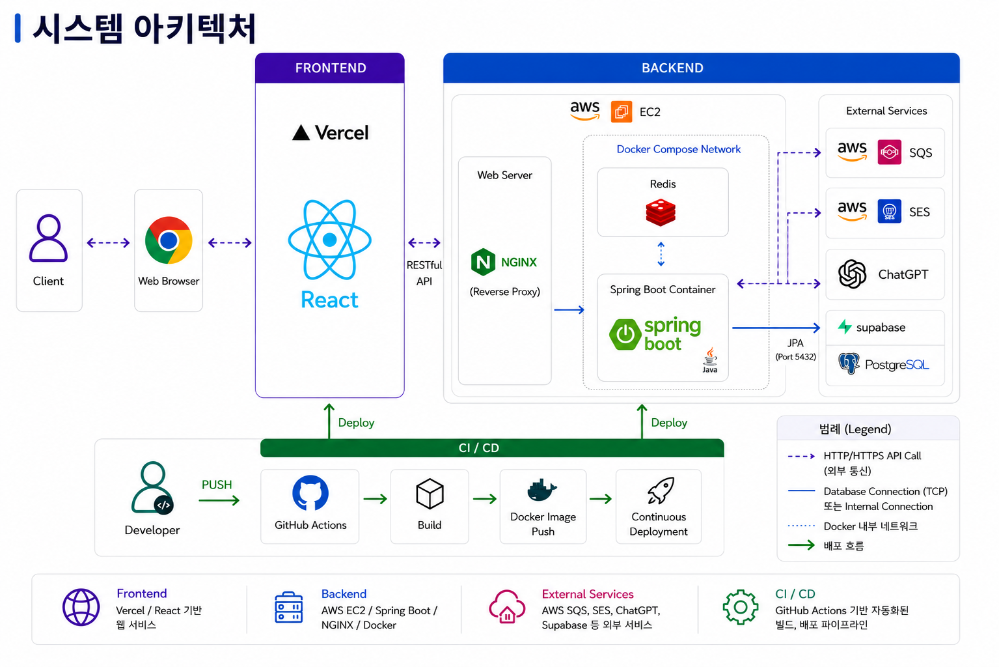

# 🤝 With Coworkers (익명 동료 평가 시스템)
> **한 달 주기의 가벼운 다면 평가를 통해 팀원들의 빠른 피드백 루프와 성장을 돕는 플랫폼**

- **개발 기간:** 2026.05 ~ 2026.07 (1인 개발)
- **서비스 링크:** [With Coworkers 바로가기](https://with-coworker.vercel.app)
- **테스트 계정:** 김수경_AI를 활용한 프로젝트_포트폴리오.pdf 파일 첫페이지 참고

---

## 🚀 프로젝트 개요 (Overview)
기존의 연간 동료 평가는 피드백 주기가 길어 실질적인 성장을 돕기 어려웠습니다. 

`With Coworkers`는 매달 6가지 객관식 역량 지표(의사소통, 지식공유, 적극성, 문제해결, 일정준수, 정확성)와 주관식 코멘트를 통해 일상적인 피드백을 주고받을 수 있는 비공개 팀 공간을 제공합니다.

---

## 🛠 기술 스택 (Tech Stack)
- **Backend:** Java 21, Spring Boot, Spring Data JPA
- **Frontend:** React, Vercel
- **Database & Infra:** Supabase (PostgreSQL), Redis (Docker), AWS EC2, AWS SQS, AWS SES
- **AI Integration:** OpenAI API
- **CI/CD:** GitHub Actions
- **AI Pair Programming:** Claude

---

## 🏗 시스템 아키텍처 (Architecture)

### 💡 주요 아키텍처 설계 특징
1. **인프라 격리 및 자원 효율성:** 단일 EC2 인프라 내에서 Docker를 활용하여 웹 서버(Nginx), 애플리케이션(Spring Boot), 인메모리 캐시(Redis)를 독립된 컨테이너로 격리하여 비용을 최적화하고 환경 일관성을 확보했습니다.
2. **리버스 프록시 적용:** Nginx를 앞단에 배치하여 외부 요청을 안전하게 수신하고 내부 WAS 컨테이너로 라우팅하는 구조를 구축했습니다.
3. **비동기 이벤트 기반 알림 인프라:** 매달 진행되는 자동 리마인드 알림 발송 시 시스템 병목을 방지하기 위해 AWS SQS와 SES를 연동하여 비동기 메시징 기반의 안정적인 메일 발송 시스템을 구현했습니다.

---

## 🔥 핵심 기능 및 구현 내용 (Core Features)

### 📊 육각형 역량 평가 및 AI 주관식 피드백 정제 (핵심 기능)
- **6대 핵심 객관식 지표 스캔:** 협업에 필수적인 6가지 핵심 역량(의사소통, 지식공유, 적극성, 문제해결, 일정준수, 정확성)을 5점 척도로 세분화하여 동료의 다면 평가를 정밀하게 수집합니다.
- **✨ LLM 연동 AI 피드백 교정 시스템:** 주관식 코멘트 작성 시 익명성에 기댄 감정적인 비난이나 무성의한 텍스트를 감지하고, 버튼 클릭 한 번으로 **"조직의 성장을 돕는 건설적이고 정중한 비즈니스 피드백 문체"**로 자동 변환·교정해 주는 AI 편의 기능을 구현했습니다.

### 📊 내 평가 결과 대시보 드 및 데이터 시각화
- 종합 평균 및 핵심 지표(강점/약점) 메트릭 스캔 기능 구현.
- 대용량 피드백 데이터를 분기/월별 점수 추이 차트 및 방사형(Radar) 그래프로 시각화하여 시간에 따른 변화를 직관적으로 분석 가능.
- **포트폴리오 및 인쇄용 PDF 내보내기:** 대시보드에 시각화된 육각형 역량 차트와 익명 피드백 리포트를 한눈에 볼 수 있도록 깔끔한 양식의 PDF 문서 다운로드 기능 구현.
- 동료들의 익명 코멘트를 안전하게 보호하고 아코디언 UI로 가독성 높게 제공.

### ⏰ 월간 자동 알림 및 리마인더 (AWS SQS + SES)
- 평가 마감 주기에 맞춰 (마감 7일 전, 2일 전, 당일 등) 스케줄러를 통한 자동 리마인드 이메일 발송.
- 대량 이메일 발송 시 사용자 요청 스레드가 차단되지 않도록 **AWS SQS큐**를 거쳐 **AWS SES**로 비동기 처리하여 백엔드 애플리케이션 가용성 확보.

---

## 🧠 트러블 슈팅 (Troubleshooting & Architecture Decisions)

### 1️⃣ AWS EC2 프리 티어 환경의 메모리 고갈로 인한 서버 다운 해결 (Swap Memory)
* **상황(Situation):** 프로젝트 배포를 완료한 직후, 잘 작동하던 시스템 API 호출 시 간헐적으로 502 Bad Gateway 에러가 발생하며 웹 서비스가 마비되는 현상이 발생하였습니다. EC2 인스턴스 확인 결과, 운영 중이던 백엔드 애플리케이션(Spring Boot) 프로세스가 비정상적으로 종료(Exit(137))되어 있는 상태였습니다.
* **원인(Problem):** 요청을 가장 앞단에서 중재하는 리버스 프록시인 NGINX의 시스템 에러 로그(/var/log/nginx/error.log)를 추적 및 분석했습니다. 분석 결과, 백엔드 컨테이너로 연결이 실패했다는 로그와 함께 OS 레벨에서 OOM(Out Of Memory) 커널 킬러에 의해 Spring Boot 프로세스가 강제 강등 및 종료된 로그를 발견했습니다. AWS t3.micro 프리티어 인스턴스의 제한된 가용 물리 메모리(RAM 1GB) 환경에서 시스템을 구동하다가 물리적 한계 용량을 초과하여 발생한 아키텍처 리소스 고갈 문제였습니다.
* **해결(Action):** 비용적인 한계 내에서 무료 프리티어 인스턴스를 유지하면서도 시스템을 안정화할 수 있는 리눅스 OS 레벨의 아키텍처 대안인 스왑 메모리(Swap Space) 배치를 결정했습니다. EC2 시스템의 루트 볼륨 SSD 하드디스크 공간 중 2GB를 임시 가상 메모리로 차용하도록 스왑 파일을 생성하고 등록했습니다. 물리 메모리 용량이 부족해질 때 사용 빈도가 낮은 메모리 페이지를 하드디스크 영역으로 Swap-out 시켜 RAM 공간을 확보하는 최적화를 인프라 명령어를 통해 영구 적용했습니다.
* **결과(Result):** 가용 가상 메모리가 물리 1GB에서 논리 총 3GB(RAM 1GB + Swap 2GB) 수준으로 여유 있게 늘어났습니다. 컨테이너가 장시간 구동되더라도 OOM 현상 및 프로세스 셧다운이 완전히 사라졌으며, 502 Bad Gateway 에러 없이 서버가 24시간 안정적으로 가동되는 인프라 회복 탄력성을 확보했습니다.

---

### 2️⃣ Mixed Content 차단과 CORS 오류 해결을 위한 Vercel Reverse Proxy 구축
* **상황(Situation):** HTTPS 보안 프로토콜이 적용된 Vercel 프론트엔드에서 HTTP 환경인 AWS EC2 백엔드 API 서버로 로그인 및 데이터 요청을 보낼 때, 브라우저 보안 제약으로 인해 API 호출이 차단되는 현상이 발생했습니다.
* **원인(Problem):**
  1. **Mixed Content 차단:** 현대 웹 브라우저는 보안상 HTTPS 프로토콜로 서빙되는 사이트에서 안전하지 않은 HTTP API를 호출하는 행위를 엄격히 차단합니다.
  2. **CORS(Cross-Origin Resource Sharing) 제한:** 프론트엔드 배포 도메인과 백엔드 EC2의 도메인이 달라 브라우저의 교차 출처 자원 공유 제한에 걸렸습니다.
* **해결(Action):**
  1. **Vercel Reverse Proxy 설정:** 백엔드에 SSL을 적용하지 않았기 때문에 브라우저가 EC2와 직접 통신하지 않고 Vercel 호스팅 서버가 백엔드와 대신 HTTP 통신을 수행하도록 `vercel.json`에 리버스 프록시 라우팅을 구현했습니다.
  2. **AWS 탄력적 IP(Elastic IP) 할당:** EC2 인스턴스에 고정 IPv4 주소를 매핑하여 인프라의 주소 안정성을 확보했습니다.
* **결과(Result):**
  * **Mixed Content 문제 해소:** 브라우저–Vercel 구간은 HTTPS 통신을, Vercel–EC2 구간은 서버 간 HTTP 통신을 각각 유지하게 되어, 브라우저의 보안 정책에 저촉되지 않고 API 요청이 정상적으로 처리됩니다.
  * **CORS 문제 해소:** 프론트엔드와 백엔드의 모든 요청이 Vercel 도메인 하나로 통합되어, 브라우저가 이를 동일 출처로 인식하면서 별도의 CORS 설정 없이도 교차 출처 요청이 자유롭게 오가게 되었습니다.

---

### 3️⃣ GitHub Actions 비대화형(Non-interactive) 모드에 따른 환경변수 주입 실패 해결
* **상황(Situation):** GitHub Actions 워크플로우를 통해 운영 서버 자동 배포(`docker compose up`)를 진행했을 때, 백엔드 컨테이너가 시스템의 필수 환경 변수들을 읽어오지 못해 구동 에러가 발생했습니다.
* **원인(Problem):** GitHub Actions 러너가 SSH를 통해 배포 서버에 접속할 때는 **비대화형(Non-interactive) 및 비로그인(Non-login) 쉘 모드**로 명령을 실행합니다. 이 때문에 운영 서버의 로컬 환경 변수가 등록된 `~/.bashrc` 파일이 자동으로 로드되지 않아 변수들을 식별할 수 없었던 것이 원인이었습니다.
* **해결(Action):** 외부 실행 환경에 의존하지 않는 안전한 배포를 위해, Docker Compose의 내장 메커니즘을 활용하기로 결정했습니다. EC2 백엔드 프로젝트 루트 경로에 `.env` 파일을 직접 생성하고 실행에 필요한 환경 변수들을 명시해 두었습니다.
* **결과(Result):** `docker compose` 명령어가 구동될 때 현재 폴더 내부의 `.env` 파일을 자동으로 검색하여 변수를 주입하는 규칙 덕분에, GitHub Actions의 실행 모드와 관계없이 컨테이너 내부로 필요한 환경 변수들이 안전하고 일관되게 주입되도록 자동화 인프라를 보완했습니다.

---